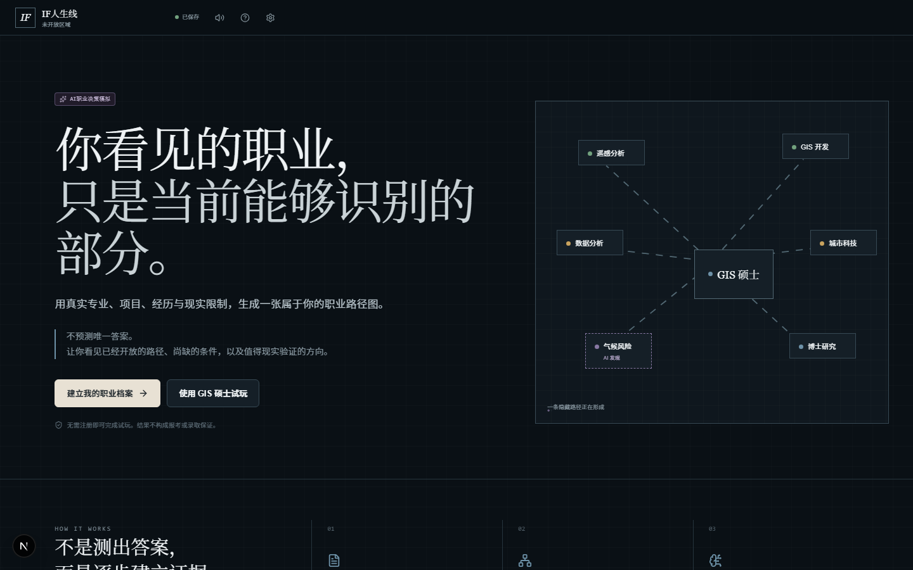
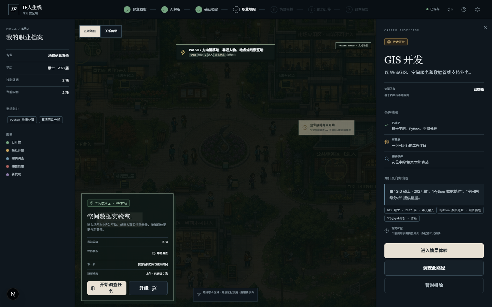
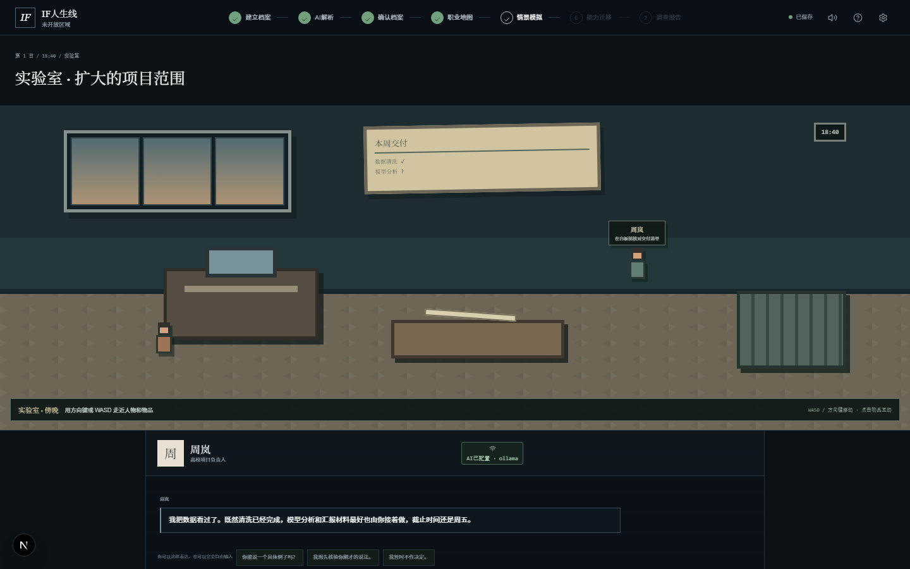
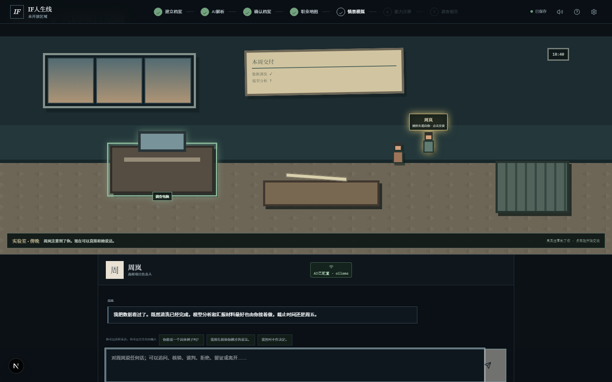

# IF 人生线：未开放区域

> 走进一座由现实职业构成的像素小镇。调查线索、认识角色、验证机会，并决定你愿意为哪条人生路线付出代价。



《IF 人生线：未开放区域》是一款正在开发中的 **AI 职业人生模拟游戏**。

它把玩家真实的专业、项目、简历和现实限制变成游戏世界中的能力、证据与职业区域。玩家控制像素小人在地图中移动，进入实验室、办公室等地点，观察环境、调查物件，并与拥有固定人设和长期记忆的 AI NPC 自由交谈。

这不是职业性格测试，也不是传统招聘网站。游戏不会替玩家宣布“最适合的职业”，而是让不同路线的门槛、机会、风险和代价在探索过程中逐渐显现。

## 你在游戏里做什么

```text
上传简历 / 建立角色
        ↓
获得初始能力与现实限制
        ↓
控制像素小人探索职业世界
        ↓
进入地点、调查物件、与 NPC 自由交谈
        ↓
收集证据并改变职业路线状态
        ↓
重组能力，决定下一次现实行动
```

在当前实验室垂直切片中，玩家可以：

- 使用方向键或 WASD 控制像素角色移动；
- 观察 NPC 在白板、工位和电脑之间活动；
- 靠近 NPC，让对方注意到玩家并开始交谈；
- 调查电脑、会议纪要和提交记录；
- 用自由文字追问、核验、谈判、拒绝、留证或离开；
- 看到调查获得的证据真实改变任务和职业地图；
- 刷新页面后继续此前的对话、证据和任务状态。

## 游戏画面

### 探索职业小镇



玩家不是在表格里挑选职业，而是在一张可移动的职业世界中发现区域。左侧是角色当前拥有的证据与限制，右侧解释选中路线为什么开放、还缺什么，以及哪些条件仍需调查。

### 进入实验室



室内场景不是静态背景。玩家可以移动到电脑、桌面文件和资料柜旁调查，也可以观察 NPC 当前正在做什么，再决定何时靠近。

### 调查证据并与 NPC 交谈



调查过的物件会在场景里留下可见状态。靠近 NPC 后，对方会停止原有活动、注意玩家，并进入自由文字交谈；AI 负责自然表达，规则引擎决定证据、关系和任务是否变化。

## 游戏的核心特色

### 像素职业世界

职业不是菜单中的几个按钮，而是可以探索的地点与区域。玩家可以移动、进入建筑、接近人物、发现物件，并通过行动打开新的信息和路线。

画面方向是 **俯视像素生活模拟 + 成熟的现实职业叙事**。它借鉴生活模拟游戏的空间感和探索感，但不复制具体游戏的美术、地图或角色。

### 有人设的 AI NPC

NPC 的台词由 AI 自然生成，但人物本质不由 AI 随意改写。每个角色都有策划预先设定的：

- 核心动机与道德边界；
- 公开形象与私下策略；
- 知道、隐瞒和不知道的信息；
- 权力、资源、压力与依赖关系；
- 语言风格、长期记忆和行为限制。

NPC 可以回避、误判、试探、施压、让步或拒绝，却不能突然改变阵营、凭空泄露秘密，或者为了迎合玩家无条件送出成功结局。

### 自由对话，但不是无规则聊天

玩家不必从固定选项中选择，可以直接输入任何话。系统会先把输入理解为结构化行动意图，例如：

- 询问信息；
- 核验说法；
- 协商任务范围；
- 确认成果归属；
- 拒绝要求；
- 保存证据；
- 指出矛盾；
- 寻求合作或退出关系。

AI 负责“角色怎么说”，TypeScript 规则引擎负责“世界实际发生什么”。因此聊天可以自然，但任务事实、资源变化和结局边界仍然稳定。

### 证据驱动的职业地图

游戏不显示虚假的匹配百分比。每条职业路线根据玩家的真实证据呈现为：

| 状态 | 含义 |
| --- | --- |
| 已开放 | 已具备主要进入条件，可以开始尝试 |
| 接近开放 | 还缺少一至两项可补足条件 |
| 需要调查 | 信息存在歧义，不能直接下结论 |
| 硬性受限 | 存在学历、专业、身份、年限或资格门槛 |
| 时间敏感 | 受到校招、考试、申请或应届窗口影响 |
| 新发现 | 能力迁移可能成立，但仍需现实证据支持 |

玩家在场景中取得的新证据会回写职业地图，而不是只作为装饰性收藏品。

## AI 与游戏规则如何协作

```text
玩家输入
   ↓
意图解析器：玩家想做什么？
   ↓
确定性规则引擎：这次行动允许造成什么变化？
   ↓
NPC 决策器：角色会采取什么策略？
   ↓
AI 台词生成器：用符合人设的自然语言表演
   ↓
验证器：是否泄密、改写事实或越过结局边界？
   ↓
对话、证据、关系、任务与职业地图更新
```

模型不可用、超时或输出不合规时，游戏会使用本地安全台词继续运行，不让 AI 故障破坏规则状态。

## 当前版本

当前仓库是 **可运行的开发中 MVP / 实验室垂直切片**，还不是完成版商业游戏。

已经实现：

- GIS 硕士预设角色；
- 文本建档与 PDF、DOCX、TXT 简历上传；
- AI 档案卡提取与本地规则回退；
- 30 个职业节点和证据驱动的职业门状态；
- 像素职业区域地图与 Phaser 2D 地图底座；
- 玩家移动、地点进入、NPC 巡游和室内互动；
- 实验室可玩场景和可调查物件；
- 自由文字 AI NPC 对话；
- 作者设定主导的任务与 NPC 约束；
- 确定性任务状态机和后果引擎；
- NPC 长期记忆、对话摘要和本地进度保存；
- AI 不可用时的本地回退；
- 桌面端和移动端响应式界面。

仍在开发：

- 正式四方向角色 Sprite Sheet 与更完整的动作动画；
- 更多室内外地图、碰撞层和可操作物品；
- NPC 完整日程、主动事件和 NPC 之间的互动；
- 更丰富的任务分支和延迟后果；
- 账号系统与真正的跨设备云存档；
- 可追溯的真实岗位数据源；
- 音乐、环境音、角色肖像和完整视觉资产；
- 内容平衡、可访问性与公开发行测试。

## 本地运行

需要 Node.js 20.19 或更高版本。

```bash
npm install
npm run dev
```

打开 [http://localhost:3000](http://localhost:3000)。

常用命令：

```bash
npm run dev          # 启动开发服务器
npm run typecheck    # TypeScript 类型检查
npm run lint         # ESLint 检查
npm run build        # Next.js 生产构建
npm run build:pages  # 生成 CloudBase 静态托管版本
```

## 配置 AI

游戏支持本地 Ollama，也支持与 OpenAI Chat Completions 格式兼容的服务端模型接口。即使不配置模型，主要流程仍可使用本地 Mock 和安全回退运行。

先复制环境变量模板：

```powershell
Copy-Item .env.example .env.local
```

### 本地 Ollama

```env
AI_PROVIDER=ollama
AI_BASE_URL=http://127.0.0.1:11434/v1
AI_MODEL=qwen3:4b
AI_MOCK_MODE=false
```

确保 Ollama 已启动并已安装对应模型：

```bash
ollama pull qwen3:4b
ollama serve
```

### 硅基流动等兼容的公网模型服务

```env
AI_PROVIDER=siliconflow
AI_BASE_URL=https://api.siliconflow.cn/v1
AI_MODEL=Qwen/Qwen2.5-7B-Instruct
SILICONFLOW_API_KEY=your-server-side-key
AI_MOCK_MODE=false
```

实际变量名称请以 [.env.example](./.env.example) 为准。

> 不要把真实 Token 写入 README、源码或 `.env.example`。密钥只能保存在本地 `.env.local` 或部署平台的加密环境变量中。任何曾出现在聊天、截图或公开提交中的密钥都应立即轮换。

## 项目结构

```text
src/
  app/                    页面、全局样式与 API 路由
  ai/                     AI Schema、对话生成与校验
  components/
    career-map/           像素地图、职业网络与地点入口
    scenario/             室内场景、任务与自由对话
  data/
    npcs/                 可编辑 NPC 作者设定
    missions/             可编辑任务定义
    dialogue-styles/      角色语言风格
  engine/                 任务、关系、意图与确定性后果引擎
  server/                 服务端 AI 和档案解析服务
  store/                  Zustand 游戏状态
  types/                  游戏领域类型
public/
  assets/pixel/           像素地图与角色素材
```

## 设计原则

1. **先是游戏，再是报告。** 玩家通过移动、发现和互动理解职业世界。
2. **AI 表演，规则裁决。** 模型不能直接修改硬门槛、资源和结局。
3. **角色不是聊天皮肤。** NPC 有稳定动机、知识边界、记忆和利益。
4. **证据比匹配度重要。** 所有职业判断都要说明依据、缺口和不确定性。
5. **没有唯一正确选择。** 每个决定都可能同时带来收益、代价和机会成本。
6. **游戏连接现实。** 最终目标不是预测人生，而是形成低成本、可验证的现实行动。

## 部署说明

项目可以部署在 Vercel，也可以将静态前端托管到腾讯云 CloudBase，并把 AI 与简历解析放在独立的服务端函数中。

纯静态托管不能安全保存模型密钥，也不能直接承载 Next.js 服务端 API。公网版本需要：

- 静态前端或完整 Next.js 托管；
- 服务端 AI 代理，避免向浏览器暴露 Token；
- 简历解析服务；
- 如需跨设备存档，还需要身份认证和数据库。

CloudBase 相关构建命令：

```bash
npm run build:pages
npm run build:cloudbase
```

## 文档

- [PRODUCT_AUDIT.md](./PRODUCT_AUDIT.md)：产品审计与重构记录
- [PIXEL_ASSET_SPEC.md](./PIXEL_ASSET_SPEC.md)：像素角色、地图与素材规范
- [OPEN_WORLD_EXPLORATION_DESIGN.md](./OPEN_WORLD_EXPLORATION_DESIGN.md)：开放探索与 NPC 世界设计

## 项目状态与贡献

项目目前处于原型迭代和内部测试阶段。欢迎提交 Issue，尤其是：

- 哪一段不像游戏；
- NPC 在什么地方失去“活人感”；
- 哪个选择没有产生可感知的后果；
- 哪条职业判断缺少证据；
- 哪个移动端流程无法完成。

如果贡献代码，请先运行：

```bash
npm run typecheck
npm run lint
npm run build
```

## 免责声明

本项目用于职业探索和决策训练，不构成职业资格认定、招聘承诺、考试预测、心理诊断或投资建议。现实岗位资格应以招聘单位、考试主管部门、学校和其他正式机构发布的信息为准。

---

**它不替你找到“正确人生”。它希望让你在信息不完整、资源有限的现实里，做出更清醒、可验证、仍然保留调整空间的选择。**
